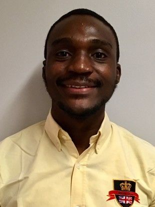

# A brief info about Tobi Ore
------------------------------  
## Background
Tobi Ore, from Ekiti State, Nigeria, is pursuing a masters in geology at West Virginia University. He graduated from the University of Lagos with a bachelor’s degree in geophysics, where he was the best graduating geophysics student magna cum laude. Tobi aspires to become a professor of geophysics, conducting research in the field of seismic interpretation, reservoir characterization, and machine learning. During his undergraduate studies, he served as the president of the science student's association. His current research borders the field of geophysics and petroleum engineering where he is creating new data-driven algorithms to predict geomechanical properties of unconventional reservoirs such as brittleness.

## Hobbies
In his spare time, 
   * he plays basketball (formerly professional); 
   * he plays video games (sports); and 
   * he love traveling. 

## Research Interest
Tobi is interested in the following research fields;
  + Seismic interpretation
  
   1) Numbered lists
      * bulleted lists
          + more lists 
          + more stuffs
          + extra stuffs  

#### Emphasis
_Emphasis_  
__Strong emphasis__   

#### Code 
In `line` code  

```bash
blocks of code  
with multiple lines  
```
#### [Links to websites](https://amyhessl.faculty.wvu.edu/home)

_Challenge:_ Add an image
---------------------------

