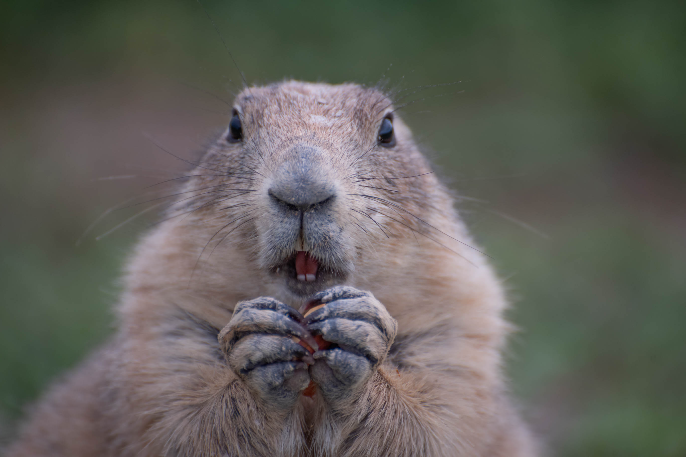

# HW_0
## Homework 0: Make a README.md about yourself!
Tell me a little bit about yourself and your interests.  
Please make use of as many of the `.md` formatting tools as possible.  At a minimum, include:

#### __Meet Hartford__ 

```
Welcome 
to
my
life!
```

#### Interests  
   1) Geography
      * Physical Geography
         + _Dendrochronology_
         + _Fire Ecology_
         + _Crazy Storms_
   2) Photography
      * Macro 
      * Landscape
      * Prairie Dogs in South Dakota
   3) Singing
      * Imagine Susan Boyle with strep

#### [Links to websites](https://www.geography.wvu.edu/)

_Challenge:_ Add a Prairie Dog
---------------------------

